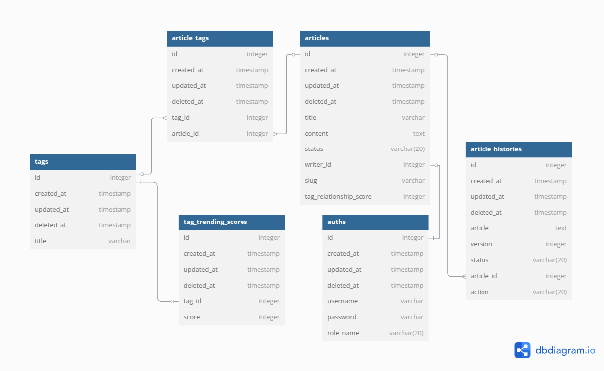

# Article CMS

This repository contains a cms service built using golang

## Installation Using Docker Compose

After cloning this repository, please create a .env file and copy-paste the content from .env.example file

And then, execute this command at the project root directory:

```bash
docker compose up -d
```

## Running Integration and Unit Testing

To run unit test and integration test. Just execute command bellow at the root of the project directory:
```bash
go test ./...
```

## Features

- Swagger provided: All endpoints can be tried by accessing the swagger docs: http://localhost:9000/swagger/index.html
- Unit Test: each services has average of more than 90% coverage 
- Authentication using JWT
- Dockerized
- Integration testing 

## Deployment to Production
Deployment can be done using jenkins. The sample of jenkinsfile provided in `Jenkinsfile.sample` this file is the general template template to push and deploy a service to remote server

## DB Schema
Here is the db schema used in this service:
